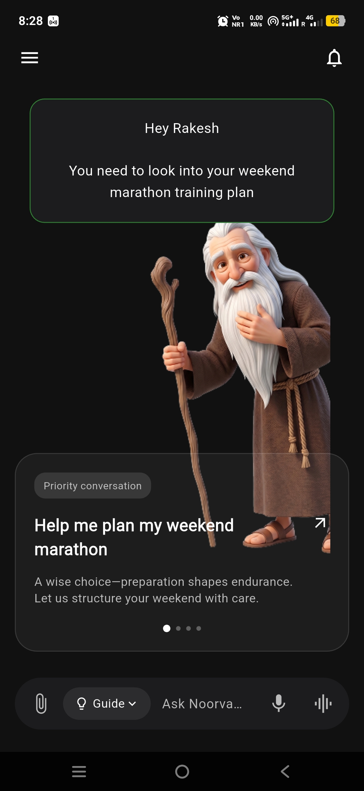
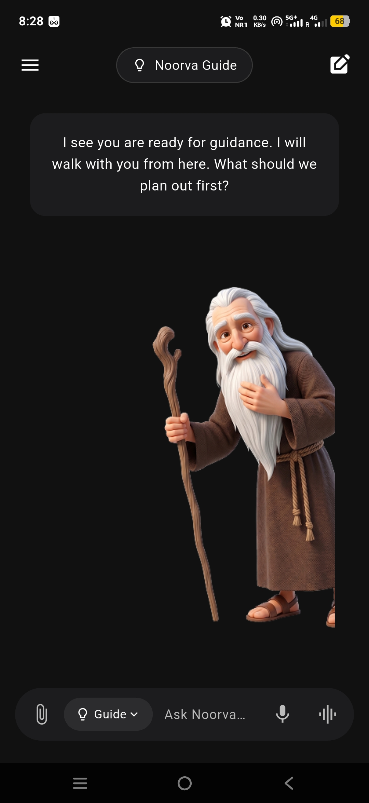

# Noorva App - Flutter UI Assessment

A beautiful, high-fidelity Flutter UI clone of the Noorva Assistant application, built as a technical assessment.

## 📸 Screenshots

<p align="center">
  
  &nbsp;&nbsp;&nbsp;&nbsp;
  
</p>

## 🚀 Features Implemented
* **Pixel-Perfect UI:** Closely matches the provided Figma dark-mode design.
* **Pragmatic Clean Architecture:** Feature-first folder structure separating core themes from presentation logic for ultimate scalability.
* **Fluid Animations:** Utilizes `AnimatedSwitcher`, `AnimatedPositioned`, and `AnimatedOpacity` for seamless, professional state transitions between the 'Home' and 'Guide' modes.
* **Modular Widgets:** Highly reusable UI components (custom app bars, chat bubbles, and input consoles).

## 🛠️ Architecture Structure
```text
lib/
 ├── core/
 │   └── theme/
 │       └── app_colors.dart
 ├── features/
 │   └── chat/
 │       ├── presentation/
 │       │   ├── screens/
 │       │   │   └── noorva_screen.dart
 │       │   └── widgets/
 │       │       ├── bottom_input_bar.dart
 │       │       ├── chat_bubble.dart
 │       │       ├── priority_card.dart
 │       │       └── top_nav_bar.dart
 └── main.dart